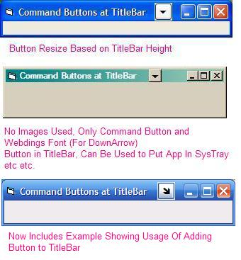



## Add Command Buttons To Form's TitleBar \(Updated: 20\-Feb\-2005\)

### Description

Updated: 20-Feb-2005. Now Include Example Showing Its Uses (Add To SysTray Code)

This code allows you to add any command button (or any control with hwnd) to the VB forms's title bar. Take a look at my other PSC submission ID: 58620
 
### More Info
 

             |
---                |---
**Submitted On**   |2005-02-05 00:32:02
**By**             |[Abhishek\.NET](https://github.com/Planet-Source-Code/PSCIndex/blob/master/ByAuthor/abhishek-net.md)
**Level**          |Intermediate
**User Rating**    |4.8 (367 globes from 77 users)
**Compatibility**  |VB 4\.0 \(32\-bit\), VB 5\.0, VB 6\.0
**Category**       |[Custom Controls/ Forms/  Menus](https://github.com/Planet-Source-Code/PSCIndex/blob/master/ByCategory/custom-controls-forms-menus__1-4.md)
**World**          |[Visual Basic](https://github.com/Planet-Source-Code/PSCIndex/blob/master/ByWorld/visual-basic.md)
**Archive File**   |[Add\_Comman184827242005\.zip](https://github.com/Planet-Source-Code/abhishek-net-add-command-buttons-to-form-s-titlebar-updated-20-feb-2005__1-58651/archive/master.zip)

